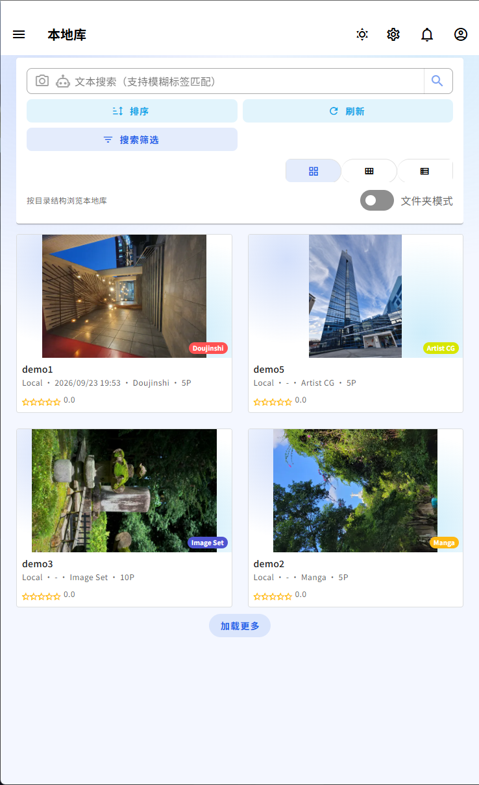
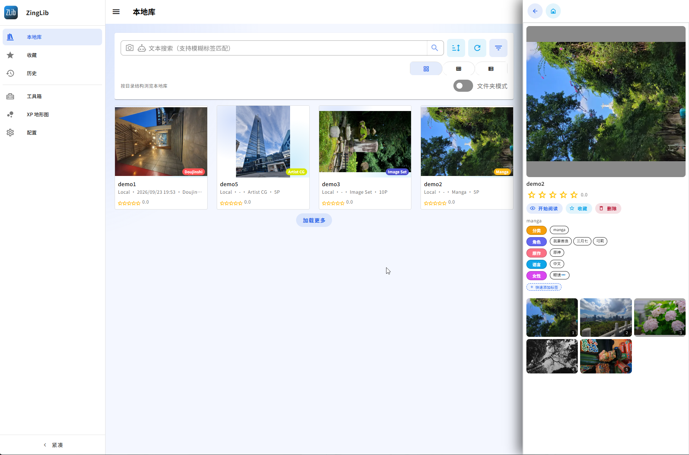
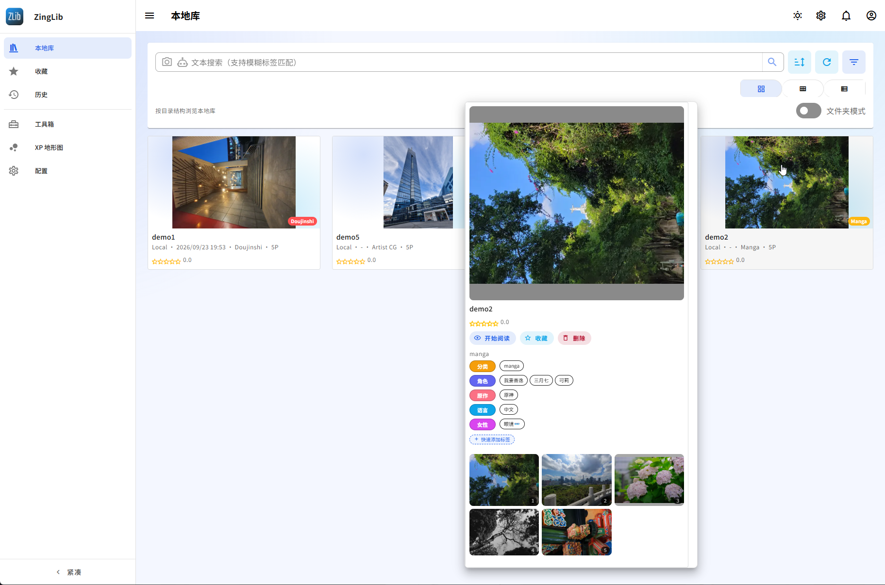
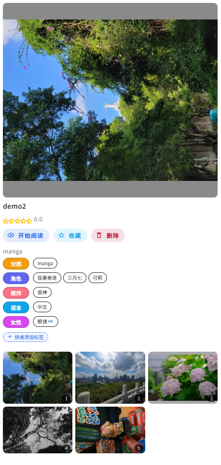
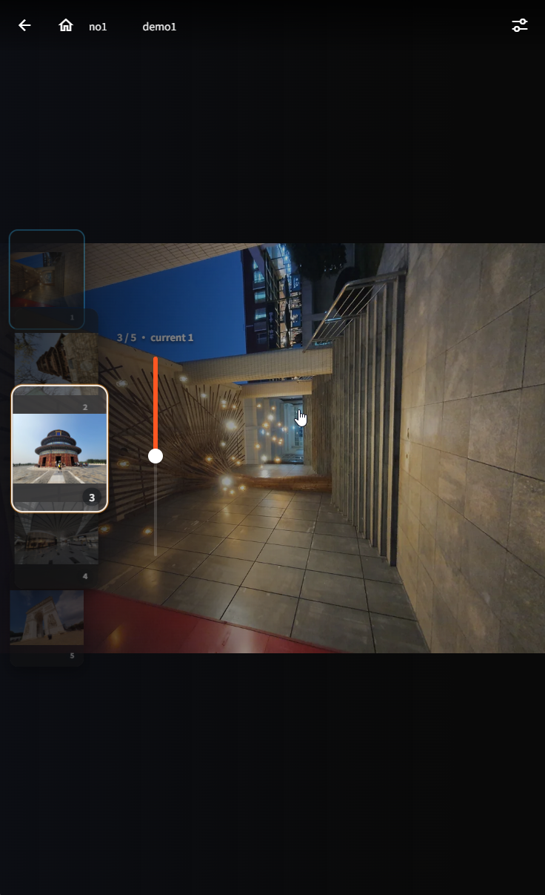
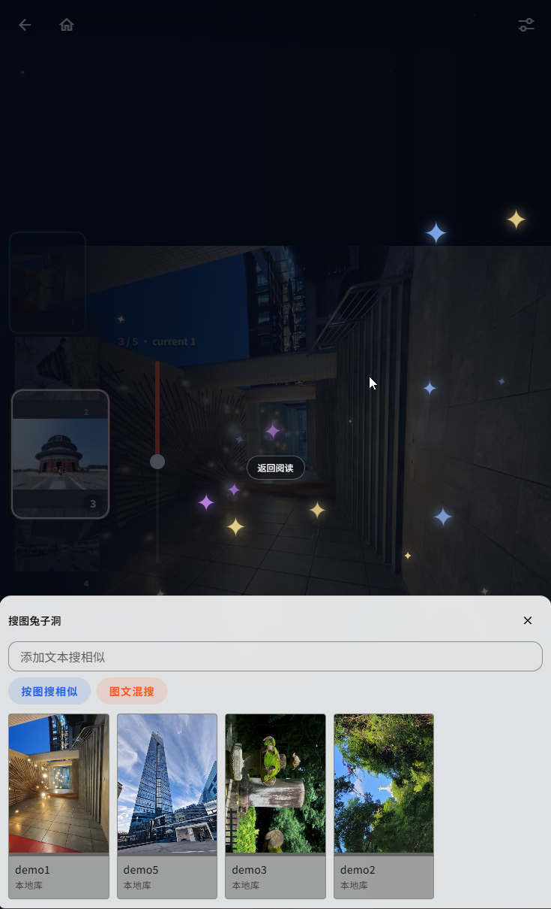

<p align="center">
  
  <br>
</p>

# ZingLib

[](LICENSE)

> 🌐 Language / 语言: [English](README_EN.md) | [中文](README.md)

## What it is

A **local-first** manga / illustration library manager. Everything comes from your own disks: it does not crawl content from the network, stores no third-party site credentials, and has no telemetry. Core library features run locally; only AI requests are sent to an endpoint when you explicitly configure an OpenAI-compatible service.

Point it at folders as they are -- no repacking into CBZ. SigLIP visual vectors give you reverse image search and "more like this". It works on phone, tablet and desktop, and installs as a PWA.

## Features

* Adaptive layout for phone / tablet / desktop, installable as a PWA
* Reads native folders plus ZIP / CBZ in place; built-in file manager and metadata editor
* Reads and writes `ComicInfo.xml`, interoperable with Komga, LANraragi and friends
* SigLIP visual search: reverse image search and "more like this"
* Reader: single page / double page / continuous scroll, preloading, thumbnail navigation, dominant-hand setting
* Reading history, favourites, custom categories, and a preference map (KMeans + PCA + KDE) built from your reading behaviour
* With a local LLM attached: natural-language search, gallery descriptions, an AI assistant

## Requirements

* **Minimum**: 4-core CPU / 4GB RAM / any system that runs Docker (NAS / Linux / Windows)
* **External dependency**: PostgreSQL 17+ with the `pgvector` extension enabled

### Model configuration (optional)

**Nothing here is required.** Browsing, reading, the file manager, `ComicInfo`, the SigLIP visual vectors and "more like this" all run inside the application container -- the vision model is downloaded and loaded by the container itself, with no external endpoint.

You only need a backend speaking the OpenAI `/v1` API (Ollama, LM Studio, vLLM, ...) if you want **natural-language search or gallery descriptions**. The endpoint may be local or a remote service you choose; using a remote service sends the relevant requests off-device. Without one, SigLIP approximate search on its own is entirely enough. Everything is configurable in the settings page and can be changed at any time.

Prefer local models over cloud APIs -- this is your own library.

### Quick start

The image is public on Docker Hub (`jbking114514/zinglib`, both `linux/amd64` and `linux/arm64`). The deployment options are ordered by preference:

**Option 1 -- one-command compose (recommended)**

`Docker/` contains **exactly one** compose file, and it brings up the **database and the application together**.
⚠️ **Do not start the application container alone** -- without a database you cannot get past the login screen, which
is why there is no longer an app-only template.

```bash
git clone https://github.com/JBKing514/ZingLib.git && cd ZingLib
docker compose -f Docker/quick_deploy_docker-compose.yml up -d
```

That gives you two containers: `zinglib-db` (PostgreSQL 17 + pgvector, 5432) and `zinglib` (the application, 8501).
The database defaults to `zinglib_library`; data lands in **`Docker/zinglib/`, beside the compose file**, and
`POSTGRES_DATA_DIR` (database) / `YOUR_LOCAL_PATH` (application runtime) move it, while `ZINGLIB_IMAGE` swaps in your own build.

**Option 2 -- manual containers (your own `docker` commands)**

For when you want to control each step, or reuse a PostgreSQL you already run:

```bash
docker network create zinglib-net
docker run -d --name zinglib-db --network zinglib-net --restart unless-stopped \
  -e POSTGRES_USER=postgres -e POSTGRES_PASSWORD=postgres -e POSTGRES_DB=zinglib_library \
  -p 5432:5432 -v /path/to/pgvector:/var/lib/postgresql/data \
  pgvector/pgvector:pg17
docker run -d --name zinglib --network zinglib-net --restart unless-stopped \
  -p 8501:8501 -v /path/to/runtime:/app/runtime \
  jbking114514/zinglib:latest data-ui
```

Both containers must share the network you create, or the application cannot resolve the database. If the database is
on **another machine**, drop `--network` and hand the application a DSN instead:
`-e POSTGRES_DSN='postgresql://postgres:postgres@<db-host>:5432/zinglib_library?sslmode=disable'`.
Do not drop `--restart unless-stopped`: after a metadata restore the application **restarts itself** to take automatic
embedding back, and without a restart policy it would simply stay down.

**Option 3 -- build from source (fallback)**

For when you want to change the code, or need an architecture the published image does not cover:

```bash
cd Docker/main && docker build -t zinglib:local .
```

Then feed that image to the Option 1 compose file:

```bash
ZINGLIB_IMAGE=zinglib:local docker compose -f Docker/quick_deploy_docker-compose.yml up -d
```

All three end the same way: open `http://<your-ip>:8501` and follow the **Setup Wizard** to configure the database and
create the first admin account. On Option 1/2 the database host is `zinglib-db` and the database name is
`zinglib_library`. No `.env` editing.

> Deployment details, directory layout, proxy settings -> [**STARTUP_EN.md**](STARTUP_EN.md)
> New machine, relocated library, or a rebuilt database -- how to get back the hours of embeddings and your reading history -> [**BACKUP_EN.md**](BACKUP_EN.md)

---

## Motivation

This project is the result of me thinking about what is wrong with the readers I have used: the existing ones either look dated, or are not built for touch, or take too many taps to do anything, or make uploading a chore. I was tired of compromising, so I vibed one myself -- which also counts as practice.

## Contributing

A spare-time hobby project. There is no promise of updates. Issues and PRs are welcome, but I am not a professional developer and may not get to them.

Stack: Vue 3 / Pinia / Vuetify / Vite · FastAPI / Psycopg 3 · PostgreSQL + pgvector · PyTorch / Transformers (SigLIP) · SciPy / Scikit-learn.
Want to change the code or run the tests? The local development environment and "what a fresh clone can run" both live in [**STARTUP_EN.md**](STARTUP_EN.md), under *Development and verification*; this README is only about getting it running.

## Credits

Architecture and layout inspired by [AstrBot](https://github.com/AstrBotDevs/AstrBot); local gallery and reader logic informed by [Komga](https://github.com/gotson/komga). 🙇

---

## Screenshots

### Mobile

<p align="center">
  
  <br>
</p>

### Tablet

<p align="center">
  
  <br>
</p>

### Desktop

<p align="center">
  
  <br>
</p>

### Gallery details

<p align="center">
  
  <br>
</p>

### Reader & search while reading

<p align="center">
  
  <br>
</p>

---

## ⚠️ Disclaimer

This tool is intended for **personal library archiving and information-retrieval research**. Users assume full responsibility for all content they import, store, or access, and must ensure its origin and use comply with the laws and regulations of their jurisdiction as well as any applicable terms of service.

## License

[MIT](LICENSE).
